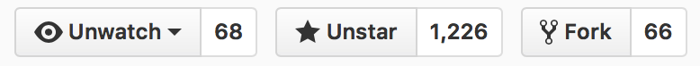
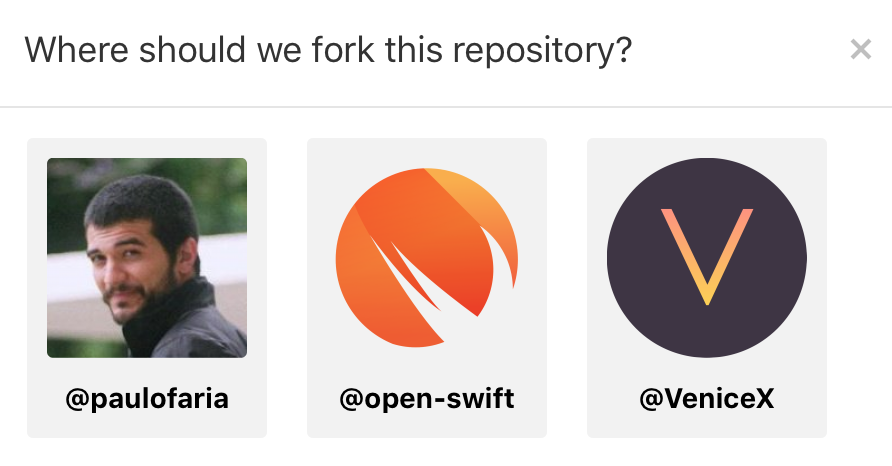
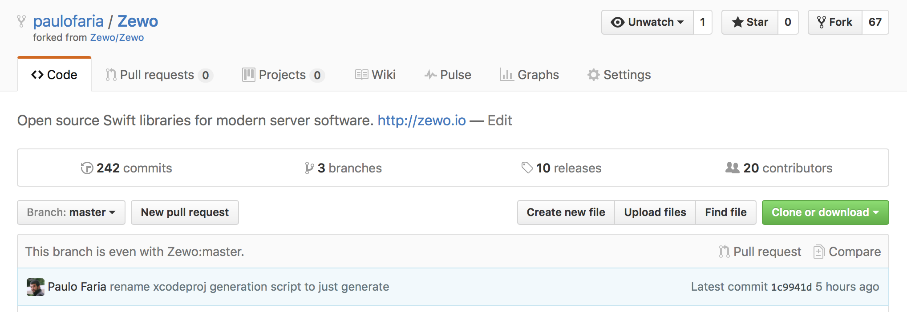
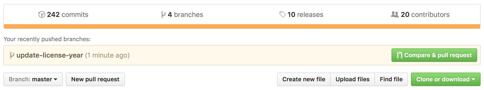
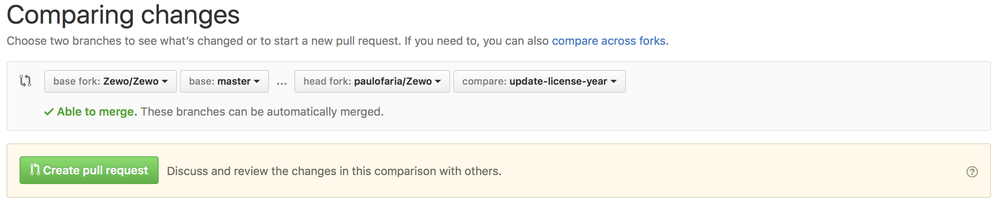
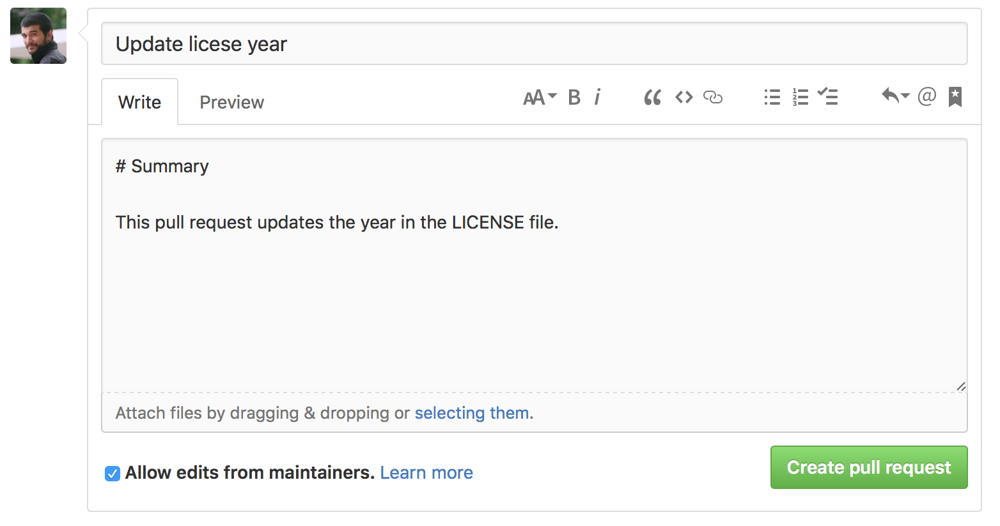
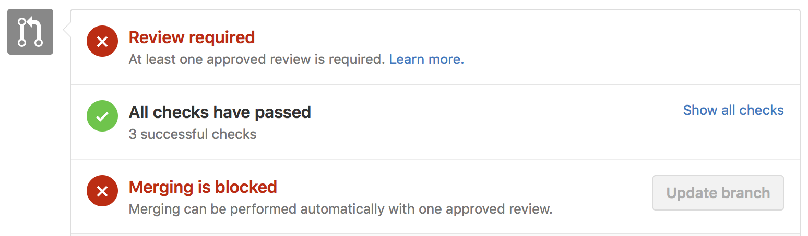
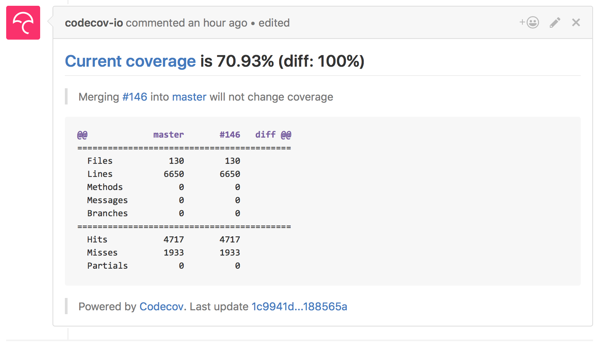
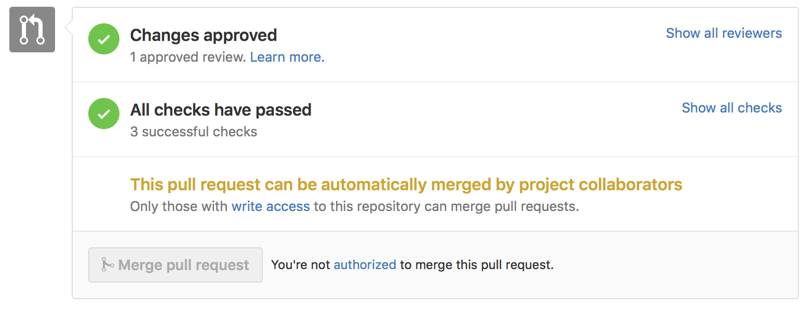

# Development Workflow

Because we have so many modules, we had to come up with a clever way to handle all the dependencies in a sane way. The way we solved the problem is by using a central repo ([Zewo/Zewo](https://github.com/Zewo/Zewo)). This repo contains all Zewo modules in one place. We develop everything at Zewo/Zewo and then using a tool called [git-subrepo](https://github.com/ingydotnet/git-subrepo) (a  better replacement for git submodules) we push all the work to the individual SwiftPM package repos.

> Really we’re a mono repo. We use subrepo to fan out the modules so they can be utilised independently of one another.
> 
> @robertjpayne™

For example, the actual swift package [Zewo/HTTPServer](https://github.com/Zewo/HTTPServer) is just a mirror of what's contained in the directory [Modules/HTTPServer](Modules/HTTPServer) inside Zewo/Zewo. So we develop everything as usual on Zewo/Zewo and when we have enough features we just push the new code to the subrepos and tag a new release. This means if you want to contribute you to Zewo most times you'll only need to clone [Zewo/Zewo](https://github.com/Zewo/Zewo).

For specific workflows read below.

## Forking Zewo

To fork Zewo just go to the [repository](https://github.com/Zewo/Zewo) and click the **Fork** button on the upper right corner of the screen.



GitHub is going to ask you where would you like to fork. Most probably you'll pick your own GitHub account.



After that you'll get a copy of the Zewo repository on your profile.



## Cloning from your fork

To clone Zewo from your fork just go to the terminal and do:

```sh
git clone https://github.com/{your-profile}/Zewo
```

Now that you have a local copy of the repo you should add Zewo/Zewo as the `upstream` remote.

```sh
git remote add upstream https://github.com/Zewo/Zewo.git
```

You can check a list of your remotes by doing.

```sh
git remote -v 
```

You'll see that you have `origin` pointing to your **fork** and `upstream` pointing to Zewo/Zewo.

```sh
origin	https://github.com/{your-profile}/Zewo (fetch)
origin	https://github.com/{your-profile}/Zewo (push)
upstream	https://github.com/Zewo/Zewo.git (fetch)
upstream	https://github.com/Zewo/Zewo.git (push)
```

## Generate the Xcode project

Development on macOS platforms can be much nicer if you use Xcode. By default we don't provide Xcode projects so you have to run a script to generate yours.

```sh
./Scripts/generate-xcodeproj.sh
```

This script will run `swift package generate-xcodeproj` and then fix the generated project since **SourceKit** doesn't like the symlinks we have to use to be able to work with **git subrepo**.

To open the Xcode project just click on it or do:

```sh
open Zewo.xcodeproj
```

## Syncing your fork

Soon your fork will be out of sync with Zewo/Zewo. To update your repo with the latests changes do.

```sh
git fetch upstream
```

Be sure to switch to your local branch `master`.

```sh
git checkout master
```

Now merge `upstream/master` to your local branch `master`.

```sh
git merge upstream/master
```

For more info check GitHub documentation on [syncing a fork](https://help.github.com/articles/syncing-a-fork/)


## Creating a Pull Request

The first thing you should when contributing is creating a branch for you changes.

```sh
git checkout -b your-branch
```

⚠️ Use meaningful names for your branches. The name should help people understand what the change is about in a global level.

Now that you're in a branch you can add, update, fix, whatever you want. If you added any new files you should do.

```sh
git add .
```

Once you're done, commit your code by doing:

```sh
git commit -am "commit message"
```

⚠️ Use meaningful messages for your commits. The name should help people understand what that specific change is about.

This process is iterative. Create small commits for each step and always make sure everything is working, the project builds and tests pass.

```sh
swift build
swift test
```

Once the tests passes push your changes to `origin` (your remote).

```sh
git push origin your-branch
```

Go to your repo and you'll see that GitHub will give you the option to create the pull request just by clicking on the **Compare & pull request** button.



If for some reason that doesn't appear anymore you can always click on the **New pull request** button which will be next to the branch selector.


When you click on **New pull request** you'll have to specify the origin and destination repos and branches manually. Make sure the base fork is Zewo/Zewo, base is master, head fork is {your-profile}/Zewo and compare is your-branch.



After clicking **Create pull request** (or if you clicked **Compare & pull request** before) you'll be able to write a title and a description for your pull request.

⚠️ Use meaningful titles and descriptions for your pull requests. This information should help people understand the changes in a global and specific level. The bigger the pull request, the bigger the description.



Once you're done click **Create pull request**. Our continous integration tools will start analyzing your pull request.



We **require** all status checks to pass and a peer review before merging. One of the checks we do is if the test coverage level dropped. We require the test coverage to always go up. Never go down.



If some test doesn't pass or the reviewer requests you to makes some changes you can just go back to your local branch. Add more commits and push then to your remote (`origin`). The commits will appear on the pull request automatically. If in the end you get to pass all steps your pull request will look like this.



After this all you have to do is wait for the pull request to be merged. 😊