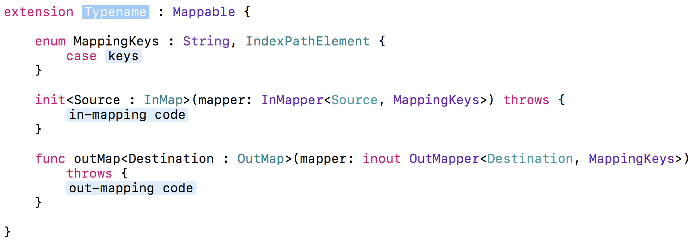
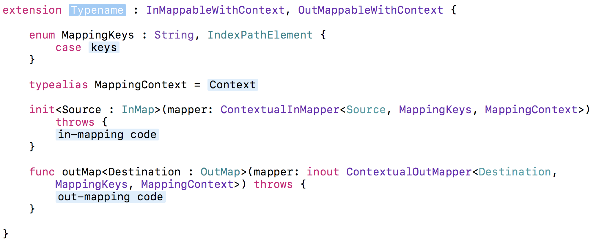

# Mapper

[![Swift][swift-badge]][swift-url]
[![Zewo][zewo-badge]][zewo-url]
[![Platform][platform-badge]][platform-url]
[![License][mit-badge]][mit-url]
[![Slack][slack-badge]][slack-url]
[![Travis][travis-badge]][travis-url]
[![Codebeat][codebeat-badge]][codebeat-url]

**Mapper** is a tiny yet very powerful library which allows you to create custom strongly-typed instances from *any* kind of structured data (**JSON** and other data interchange formats, for example) with only a single initializer. And vice versa - with only a single method.

**Mapper** extensively uses power of Swift generics and protocols, dramatically reducing the boilerplate you have to write. With **Mapper**, mapping is a breeze.

The maing advantage of **Mapper** is that you don't need to write multiple initializers to support mapping from different formats (if you've done it before - you know what I mean), thus eliminating the boilerplate and leaving only the core logic you need. With **Mapper** your code is safe and expressive.

And while reducing boilerplate, **Mapper** is also amazingly fast. It doesn't use reflection, and generics allows the compiler to optimize code in the most effective way.

**Mapper** itself is just a core mapping logic without any implementations. To actually use **Mapper**, you also have to import one of Mapper-conforming libraries. You can find a current list of them [here](#mapper-compatible-libraries). If you want to support **Mapper** for your data types, checkout [Adopting Mapper](#adopting-mapper) short guide.

**Mapper** is deeply inspired by Lyft's [Mapper](https://github.com/lyft/mapper). You can learn more about the concept behind their idea in [this talk](https://realm.io/news/slug-keith-smiley-embrace-immutability/).

## Showcase

```swift
struct City : InMappable, OutMappable {
    
    let name: String
    let population: Int
    
    enum MappingKeys : String, IndexPathElement {
        case name, population
    }
    
    init<Source : InMap>(mapper: InMapper<Source, MappingKeys>) throws {
        self.name = try mapper.map(from: .name)
        self.population = try mapper.map(from: .population)
    }
    
    func outMap<Destination : OutMap>(mapper: inout OutMapper<Destination, MappingKeys>) throws {
        try mapper.map(self.name, to: .name)
        try mapper.map(self.population, to: .population)
    }
    
}

enum Gender : String {
    case male
    case female
}

// Mappable = InMappable & OutMappable
struct Person : Mappable {
    
    let name: String
    let gender: Gender
    let city: City
    let identifier: Int
    let isRegistered: Bool
    let biographyPoints: [String]
    
    enum MappingKeys : String, IndexPathElement {
        case name, gender, city, identifier, registered, biographyPoints
    }
    
    init<Source : InMap>(mapper: InMapper<Source, MappingKeys>) throws {
        self.name = try mapper.map(from: .name)
        self.gender = try mapper.map(from: .gender)
        self.city = try mapper.map(from: .city)
        self.identifier = try mapper.map(from: .identifier)
        self.isRegistered = try mapper.map(from: .registered)
        self.biographyPoints = try mapper.map(from: .biographyPoints)
    }
    
    func outMap<Destination : OutMap>(mapper: inout OutMapper<Destination, Person.MappingKeys>) throws {
        try mapper.map(self.name, to: .name)
        try mapper.map(self.gender, to: .gender)
        try mapper.map(self.city, to: .city)
        try mapper.map(self.identifier, to: .identifier)
        try mapper.map(self.isRegistered, to: .registered)
        try mapper.map(self.biographyPoints, to: .biographyPoints)
    }
    
}

// in-mapping
let jessy = Person(from: json)
let messi = Person(from: messagePack)
let michael = Person(from: mongoBSON)

// out-mapping
let json: JSON = try jessy.map()
let messi: MessagePack = try messi.map()

// and so on...
```

## Installation

- Add `Mapper` to your `Package.swift`

```swift
import PackageDescription

let package = Package(
    dependencies: [
        .Package(url: "https://github.com/Zewo/Mapper.git", majorVersion: 0, minor: 14),
    ]
)
```

## Usage

#### Basics

**Mapper** allows you to map data in both ways, and so it has two major parts: **in** mapping (for example, *JSON -> your model*) and **out** mapping (*your model -> JSON*). So the two main protocols of **Mapper** is `InMappable` and `OutMappable`.

To use **Mapper** in it's full glory, first you need to define nested `MappingKeys` enum. `MappingKeys` are needed to represent keys from/to which your properties will be mapped. Using nested `MappingKeys` is a win for type-safety and can save you from some painful typos:

```swift
struct City {
    
    let name: String
    let population: Int
    
    enum MappingKeys : String, IndexPathElement {
        case name, population
    }
    
}
```

Make sure to declare `MappingKeys` as `IndexPathElement`!

Now we're going to write mapping code. Let's start with *in mapping*:

```swift
extension City : InMappable {
    init<Source : InMap>(mapper: InMapper<Source, MappingKeys>) throws {
        self.name = try mapper.map(from: .name)
        self.population = try mapper.map(from: .population)
    }
}

let city = try City(from: json)
```

Actually, that's it! Now your `City` can be created from JSON, BSON, MessagePack and a whole range of other data formats. And that's all thanks to the amazing power of generics. As you see, that's why your initializer is generic. And `from: .name` is actually where your `MappingKeys` are used.

Each call to `mapper` is marked with `try` because, obviously, it can fail. In this case initializer will throw with `InMapperError`. If one of your properties is optional, you can just write `try?`.

Let's continue with *out mapping*:

```swift
extension City : OutMappable {
    func outMap<Destination : OutMap>(mapper: inout OutMapper<Destination, MappingKeys>) throws {
        try mapper.map(self.name, to: .name)
        try mapper.map(self.population, to: .population)
    }
}

let json: JSON = city.map()
```

As you see, the code is pretty similar, easy to reason about, and very expressive.

As you see, both mappers have two generic arguments: `Source`/`Destination`, which is the structured data format, and `MappingKeys`, which is specific `MappingKeys` defined for your model. 

Actually, if you don't want to write that `MappingKeys`, we made `BasicInMappable`/`BasicOutMappable` just for you.

```swift
struct Planet : BasicInMappable, BasicOutMappable {
    
    let radius: Int
    
    init<Source : InMap>(mapper: BasicInMapper<Source>) throws {
        self.radius = try mapper.map(from: "radius")
    }
    
    func outMap<Destination : OutMap>(mapper: inout BasicOutMapper<Destination>) throws {
        try mapper.map(radius, to: "radius")
    }
    
}
```

#### Mapping arrays

You can map array just like anything else -- simply by using `.map`.

```swift
struct Album : Mappable {
    
    let songs: [String]
    
    enum MappingKeys : String, IndexPathElement {
        case songs
    }
    
    init<Source : InMap>(mapper: InMapper<Source, MappingKeys>) throws {
        self.songs = try mapper.map(from: .songs)
    }
    
    func outMap<Destination : OutMap>(mapper: inout OutMapper<Destination, Album.MappingKeys>) throws {
        try mapper.map(self.songs, to: .songs)
    }
    
}
```

#### Mapping enums
**Mapper** can also automatically map enums with raw values, which is neat.

```swift
enum Wood : String {
    case mahogany
    case koa
    case cedar
    case spruce
}

enum Strings : Int {
    case four = 4
    case six = 6
    case seven = 7
}

struct Guitar : Mappable {
    
    let wood: Wood
    let strings: Strings
    
    enum MappingKeys : String, IndexPathElement {
        case wood, strings
    }
    
    init<Source : InMap>(mapper: InMapper<Source, MappingKeys>) throws {
        self.wood = try mapper.map(from: .wood)
        self.strings = try mapper.map(from: .strings)
    }
    
    func outMap<Destination : OutMap>(mapper: inout OutMapper<Destination, Guitar.MappingKeys>) throws {
        try mapper.map(self.wood, to: .wood)
        try mapper.map(self.strings, to: .strings)
    }
    
}
```

#### Nesting `Mappable`s

Cool thing about **Mapper** is that you can easily map instances which are itself `Mappable`:

```swift
struct Sport : Mappable {
    
    let name: String
    
    enum MappingKeys : String, IndexPathElement {
        case name
    }
    
    init<Source : InMap>(mapper: InMapper<Source, MappingKeys>) throws {
        self.name = try mapper.map(from: .name)
    }
    
    func outMap<Destination : OutMap>(mapper: inout OutMapper<Destination, Sport.MappingKeys>) throws {
        try mapper.map(self.name, to: .name)
    }
    
}

struct Team : Mappable {
    
    let sport: Sport
    let name: String
    let foundationYear: Int
    
    enum MappingKeys : String, IndexPathElement {
        case sport
        case name
        case foundationYear = "foundation-year"
    }
    
    init<Source : InMap>(mapper: InMapper<Source, MappingKeys>) throws {
        self.sport = try mapper.map(from: .sport)
        self.name = try mapper.map(from: .name)
        self.foundationYear = try mapper.map(from: .foundationYear)
    }
    
    func outMap<Destination : OutMap>(mapper: inout OutMapper<Destination, Team.MappingKeys>) throws {
        try mapper.map(self.sport, to: .sport)
        try mapper.map(self.name, to: .name)
        try mapper.map(self.foundationYear, to: .foundationYear)
    }
    
}
```

#### Mapping with context
*(Advanced topic)*

There are some situations when you need to describe more than one way of mappings. It can be for several reasons - different sources/destinations of data, architectural restrictions and so on. For this situation we have "contextual mapping".

Let's start with something called `InMappableWithContext`:

```swift
enum SuperContext {
    case json
    case mongo
    case gordon
}

struct SuperheroHelper {
    
    let name: String
    let id: Int
    
    enum MappingKeys : String, IndexPathElement {
        case name
        case id, identifier, g_id
    }
    
    typealias MappingContext = SuperContext
    
}

extension SuperheroHelper : InMappableWithContext {
    init<Source : InMap>(mapper: ContextualInMapper<Source, MappingKeys, MappingContext>) throws {
        self.name = try mapper.map(from: .name)
        switch mapper.context {
        case .json:
            self.id = try mapper.map(from: .id)
        case .mongo:
            self.id = try mapper.map(from: .identifier)
        case .gordon:
            self.id = try mapper.map(from: .g_id)
        }
    }
}

extension SuperheroHelper : OutMappableWithContext {
    func outMap<Destination : OutMap>(mapper: inout ContextualOutMapper<Destination, SuperheroHelper.MappingKeys, MappingContext>) throws {
        try mapper.map(self.name, to: .name)
        switch mapper.context {
        case .json:
            try mapper.map(self.id, to: .id)
        case .mongo:
            try mapper.map(self.id, to: .identifier)
        case .gordon:
            try mapper.map(self.id, to: .g_id)
        }
    }
}

// now we can do
let robin = try BatmanHelper(from: robinJSON, withContext: .json)
// or
let robin = try BatmanHelper(from: robinMongo, withContext: .mongo)
// or whatever that is
let robin = try BatmanHelper(from: robinGordon, withContext: .gordon)

// And also
let robinJSON: JSON = try robin.map(withContext: .json)
```

Now let's get to something even more cool:

```swift
struct Superhero {
    
    let name: String
    let helper: SuperheroHelper
    
    enum MappingKeys : String, IndexPathElement {
        case name, helper
    }
    
    typealias MappingContext = SuperContext
    
}

extension Superhero : InMappableWithContext {
    init<Source : InMap>(mapper: ContextualInMapper<Source, MappingKeys, MappingContext>) throws {
        self.name = try mapper.map(from: .name)
        self.helper = try mapper.map(from: .helper)
    }
}

extension Superhero : OutMappableWithContext {
    func outMap<Destination : OutMap>(mapper: inout ContextualOutMapper<Destination, MappingKeys, MappingContext>) throws {
        try mapper.map(self.name, to: .name)
        try mapper.map(self.helper, to: .helper)
    }
}

let batman = try Superhero(from: batJSON, withContext: .json)
```

Noticed something strange? Yes, `self.helper` is mapped even though we didn't specify the context! That's because `Superhero` has, actually, the same context as `SuperheroHelper`, and is also `InMappableWithContext`/`OutMappableWithContext`, and so the right context is passed to `SuperheroHelper` *automatically*. This is *context infering*.

If you don't want that, you can specify the context manually:

```swift
// in
self.helper = try mapper.map(from: .helper, withContext: .json)
// out
try mapper.map(self.helper, to: .helper, withContext: .json)
```

#### Plain mapping

Tutorial by example: making **Foundation**'s `Date` conform to `Mappable`.

```swift
extension Date : Mappable {
    
    public init<Source : InMap>(mapper: PlainInMapper<Source>) throws {
        let interval: TimeInterval = try mapper.map()
        self.init(timeIntervalSince1970: interval)
    }
    
    public func outMap<Destination : OutMap>(mapper: inout PlainOutMapper<Destination>) throws {
        try mapper.map(self.timeIntervalSince1970)
    }
    
}
```

Mappers take variadic parameter as index path, so it's possible to pass no index path at all. We call it "plain mapping".

And using `MappableWithContext`, we can even do something like that:

```swift
public enum DateMappingContext {
    case timeIntervalSince1970
    case timeIntervalSinceReferenceDate
}

extension Date : InMappableWithContext {
    public init<Source : InMap>(mapper: PlainContextualInMapper<Source, DateMappingContext>) throws {
        let interval: TimeInterval = try mapper.map()
        switch mapper.context {
        case .timeIntervalSince1970:
            self.init(timeIntervalSince1970: interval)
        case .timeIntervalSinceReferenceDate:
            self.init(timeIntervalSinceReferenceDate: interval)
        }
    }
}

extension Date : OutMappableWithContext {
    public func outMap<Destination : OutMap>(mapper: inout PlainContextualOutMapper<Destination, DateMappingContext>) throws {
        switch mapper.context {
        case .timeIntervalSince1970:
            try mapper.map(self.timeIntervalSince1970)
        case .timeIntervalSinceReferenceDate:
            try mapper.map(self.timeIntervalSinceReferenceDate)
        }
    }
}
```

#### "Unsafe" mapping

**Mapper** can work only with four basic "primitive" types: `Int`, `Double`, `Bool`, `String` (these four are expected to work with any **Mapper**-conforming type). But, of course, you can map other, more specific primitive types that your format supports. In order to do that, you should use `.unsafe_map` and `.unsafe_mapArray` methods:

```swift
struct TeamStat : Mappable {

    let rate: Int32
    let goals: [Int32]
    
    enum MappingKeys : String, IndexPathElement {
        case rate, goals
    }
    
    init<Source : InMap>(mapper: InMapper<Source, MappingKeys>) throws {
        self.rate = try mapper.unsafe_map(from: .rate)
        self.goals = try mapper.unsafe_mapArray(from: .goals)
    }
    
    func outMap<Destination : OutMap>(mapper: inout OutMapper<Destination, TeamStat.MappingKeys>) throws {
        try mapper.unsafe_map(self.rate, to: .rate)
        try mapper.unsafe_mapArray(self.goals, to: .goals)
    }

}

// `BSON` supports `Int32` directly, so
let stat = try TeamStat(from: mongoDocument)
```

#### Mapping of external classes

If you have some classes that you don't have direct access to (for example, **Cocoa** classes), and you want to make them `Mappable` for some reason, you should use `BasicInMappable `/`BasicOutMappable ` with this approach:

```swift
extension BasicInMappable where Self : NSDate {
    public init<Source : InMap>(mapper: BasicInMapper<Source>) throws {
        let interval: TimeInterval = try mapper.map()
        self.init(timeIntervalSince1970: interval)
    }
}

extension NSDate : BasicInMappable { }

extension BasicOutMappable where Self : NSDate {
    public func outMap<Destination : OutMap>(mapper: inout BasicOutMapper<Destination>) throws {
        try mapper.map(self.timeIntervalSince1970)
    }
}

extension NSDate : BasicOutMappable { }
```

Now `NSDate` can be mapped as usual.

#### Productivity hack

**Mapper** boosts your productivity dramatically, but we didn't stop there. We have prepared for you [Xcode code snippets](http://nshipster.com/xcode-snippets/) located in `CodeSnippets/` directory that will speed you up even more. Just put them in `~/Library/Developer/Xcode/UserData/CodeSnippets/` and restart Xcode. Then you can just type `mappable` and Xcode will give you this:



Or type `context mappable` and you see this:



## Mapper-compatible libraries

- Zewo/Map
- Zewo/JSON

## Adopting Mapper

Swift is in process of discovering its own native patterns. One thing for sure -- enum-based structured data types are among them. The problem is that they are completely disconnected from each other, although they are similar in many ways. **Mapper**'s mission is to build bridges between these types.

There are two main protocols with which you should work: `InMap` (for *in mapping*) and `OutMap` (for *out mapping*).

Let's work from example. Imagine that we have some pretty typical enum-based type:

```swift
public enum MapperMap {
    case int(Int)
    case double(Double)
    case string(String)
    case bool(Bool)
    case array([MapperMap])
    case dictionary([String: MapperMap])
}
```

Let's look at `InMap` protocol:

```swift
public protocol InMap {
    func get(at indexPath: IndexPathValue) -> Self?
    func get(at indexPath: [IndexPathValue]) -> Self?
    func asArray() -> [Self]?
    func get<T>() -> T?
    var int: Int? { get }
    var double: Double? { get }
    var bool: Bool? { get }
    var string: String? { get }
}
```

Where `IndexPathValue` is:

```swift
public enum IndexPathValue {
    case index(Int)
    case key(String)
}
```

Also it's worth mentioning, that `get(at indexPath: [IndexPathElement])` method has default implementation, so you don't have to write it yourself.

So, here is our `MapperMap : InMap` implementation:

```swift
extension MapperMap : InMap {
    
    public func get(at indexPath: IndexPathValue) -> MapperMap? {
        switch (indexPath, self) {
        case (.key(let key), .dictionary(let dict)):
            return dict[key]
        case (.index(let index), .array(let array)):
            if array.indices.contains(index) {
                return array[index]
            }
            return nil
        default:
            return nil
        }
    }
    
    public func get<T>() -> T? {
        switch self {
        case .int(let int as T):
            return int
        case .double(let double as T):
            return double
        case .string(let string as T):
            return string
        case .bool(let bool as T):
            return bool
        case .array(let array as T):
            return array
        case .dictionary(let dict as T):
            return dict
        default:
            return nil
        }
    }
    
    public var int: Int? {
        if case .int(let value) = self {
            return value
        }
        return nil
    }
    
    public var double: Double? {
        if case .double(let value) = self {
            return value
        }
        return nil
    }
    
    public var bool: Bool? {
        if case .bool(let value) = self {
            return value
        }
        return nil
    }
    
    public var string: String? {
        if case .string(let value) = self {
            return value
        }
        return nil
    }
    
    public func asArray() -> [MapperMap]? {
        if case .array(let array) = self {
            return array
        }
        return nil
    }
    
}
```

So here what's going on: in `get<T>()` you just try to return in *any* of the type you directly support, that's it.

That seems nice. But not always we have situation that ordinary. Let's pretend that now we have new format:

```swift
public enum MapperNeomap {
    case bool(Bool)
    case int32(Int32)
    case uint(UInt)
    case uint8(UInt8)
    case string(String)
    case float(Float)
    case array([MapperNeomap])
    case dictionary([String: MapperNeomap])
}
```

Here, it's important to mention one thing.

**All** Mapper-compatible libraries are expected to work with next "primitive" types:

- `Int`
- `Double`
- `String`
- `Bool`

As you see, our `MapperNeomap` doesn't support `Int` and `Double`. So we should do this:

```swift
extension MapperNeomap : InMap {
    public func get<T>() -> T? {
        switch self {
        case .bool(let value as T):         return value
        case .int32(let value as T):        return value
        case .uint(let value as T):         return value
        case .uint8(let value as T):        return value
        case .string(let value as T):       return value
        case .float(let value as T):        return value
        case .array(let value as T):        return value
        case .dictionary(let value as T):   return value
        default:
            return nil
        }
    }
    
    public var int: Int? {
        switch self {
        case .int32(let value):     return Int(value)
        case .uint(let value):      return Int(value)
        case .uint8(let value):     return Int(value)
        default:
            return nil
        }
    }
    
    public var double: Double? {
        if case .float(let value) = self {
            return Double(value)
        }
        return nil
    }
    
    public var bool: Bool? {
        if case .bool(let value) = self {
            return value
        }
        return nil
    }
    
    public var string: String? {
        if case .string(let value) = self {
            return value
        }
        return nil
    }
}
```

Pretty verbose, yes, but necessary. Again, `Int`, `Double`, `String` and `Bool` are expected to work, even if they are not directly available in your data format.

Now let's look at `OutMap`:

```swift
public protocol OutMap {
    static var blank: Self { get }
    mutating func set(_ map: Self, at indexPath: IndexPathValue) throws
    mutating func set(_ map: Self, at indexPath: [IndexPathValue]) throws
    static func fromArray(_ array: [Self]) -> Self?
    static func from<T>(_ value: T) -> Self?
    static func from(_ int: Int) -> Self?
    static func from(_ double: Double) -> Self?
    static func from(_ bool: Bool) -> Self?
    static func from(_ string: String) -> Self?
}
```

Pretty much the same, but reversed. Again, `set(_ map: Self, at indexPath: [IndexPathElement])` has default implementation.

So, let's look at `MapperMap : OutMap`:

```swift
extension MapperMap : OutMap {
    
    public static var blank: MapperMap {
        return .dictionary([:])
    }
    
    public mutating func set(_ map: MapperMap, at indexPath: IndexPathValue) throws {
        switch (indexPath, self) {
        case (.key(let key), .dictionary(var dict)):
            dict[key] = map
            self = .dictionary(dict)
        case (.index(let index), .array(var array)):
            array[index] = map
            self = .array(array)
        default:
            throw MapperMapOutMapError.incompatibleType
        }
    }
    
    public static func fromArray(_ array: [MapperMap]) -> MapperMap? {
        return .array(array)
    }
    
    public static func from<T>(_ value: T) -> MapperMap? {
        if let int = value as? Int {
            return .int(int)
        }
        if let double = value as? Double {
            return .double(double)
        }
        if let string = value as? String {
            return .string(string)
        }
        if let bool = value as? Bool {
            return .bool(bool)
        }
        if let array = value as? [MapperMap] {
            return .array(array)
        }
        if let dict = value as? [String: MapperMap] {
            return .dictionary(dict)
        }
        return nil
    }
    
    public static func from(_ int: Int) -> MapperMap? {
        return MapperMap.int(int)
    }
    
    public static func from(_ double: Double) -> MapperMap? {
        return MapperMap.double(double)
    }

    public static func from(_ bool: Bool) -> MapperMap? {
        return MapperMap.bool(bool)
    }

    public static func from(_ string: String) -> MapperMap? {
        return MapperMap.string(string)
    }

}
```

And our neomap counterpart:

```swift
extension MapperNeomap : OutMap {
    
    public static func from<T>(_ value: T) -> MapperNeomap? {
        if let string = value as? String {
            return .string(string)
        }
        if let bool = value as? Bool {
            return .bool(bool)
        }
        if let i32 = value as? Int32 {
            return .int32(i32)
        }
        if let uint = value as? UInt {
            return .uint(uint)
        }
        if let uint8 = value as? UInt8 {
            return .uint8(uint8)
        }
        if let float = value as? Float {
            return .float(float)
        }
        if let array = value as? [MapperNeomap] {
            return .array(array)
        }
        if let dict = value as? [String: MapperNeomap] {
            return .dictionary(dict)
        }
        return nil
    }
    
    public static func from(_ int: Int) -> MapperNeomap? {
        return .int32(Int32(int))
    }
    
    public static func from(_ double: Double) -> MapperNeomap? {
        return .float(Float(double))
    }
    
    public static func from(_ bool: Bool) -> MapperNeomap? {
        return .bool(bool)
    }
    
    public static func from(_ string: String) -> MapperNeomap? {
        return .string(string)
    }

}
```

Well, that's it! Now one can easily map strongly-typed instances from and to your data type!

```swift
let user = try User(from: mapperMap)
let userMap: MapperMap = try user.map()
```

## Support

If you need any help you can join our [Slack](http://slack.zewo.io) and go to the **#help** channel. Or you can create a Github [issue](https://github.com/Zewo/Zewo/issues/new) in our main repository. When stating your issue be sure to add enough details, specify what module is causing the problem and reproduction steps.

## Community

[![Slack][slack-image]][slack-url]

The entire Zewo code base is licensed under MIT. By contributing to Zewo you are contributing to an open and engaged community of brilliant Swift programmers. Join us on [Slack](http://slack.zewo.io) to get to know us!

## License

This project is released under the MIT license. See [LICENSE](LICENSE) for details.

[swift-badge]: https://img.shields.io/badge/Swift-3.0-orange.svg?style=flat
[swift-url]: https://swift.org
[zewo-badge]: https://img.shields.io/badge/Zewo-0.14-FF7565.svg?style=flat
[zewo-url]: http://zewo.io
[platform-badge]: https://img.shields.io/badge/Platforms-OS%20X%20--%20Linux-lightgray.svg?style=flat
[platform-url]: https://swift.org
[mit-badge]: https://img.shields.io/badge/License-MIT-blue.svg?style=flat
[mit-url]: https://tldrlegal.com/license/mit-license
[slack-image]: http://s13.postimg.org/ybwy92ktf/Slack.png
[slack-badge]: https://zewo-slackin.herokuapp.com/badge.svg
[slack-url]: http://slack.zewo.io
[travis-badge]: https://travis-ci.org/Zewo/Mapper.svg?branch=master
[travis-url]: https://travis-ci.org/Zewo/Mapper
[codebeat-badge]: https://codebeat.co/badges/d08bad48-c72e-49e3-a184-68a23063d461
[codebeat-url]: https://codebeat.co/projects/github-com-zewo-mapper
