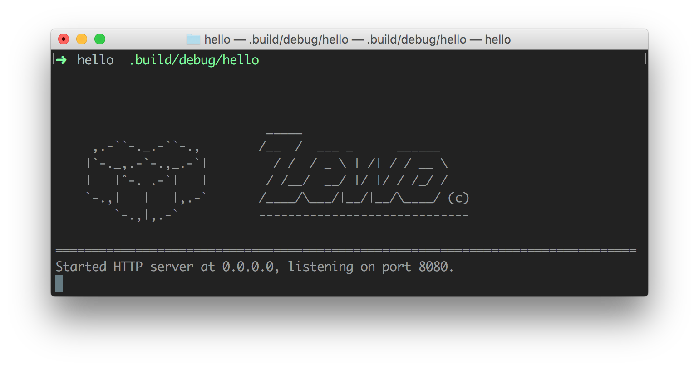
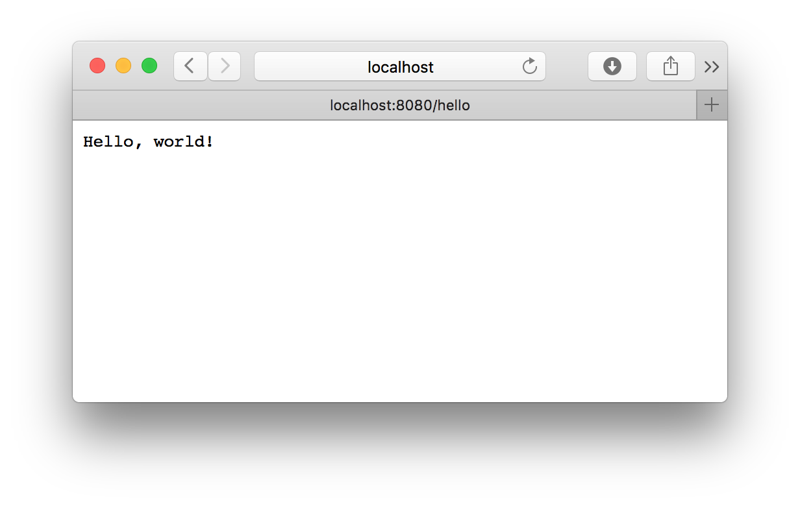
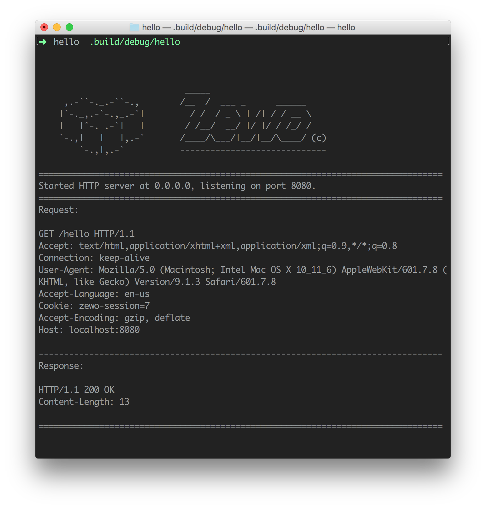
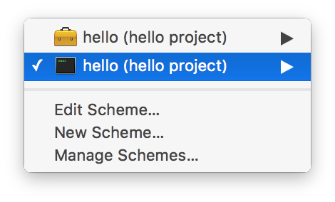
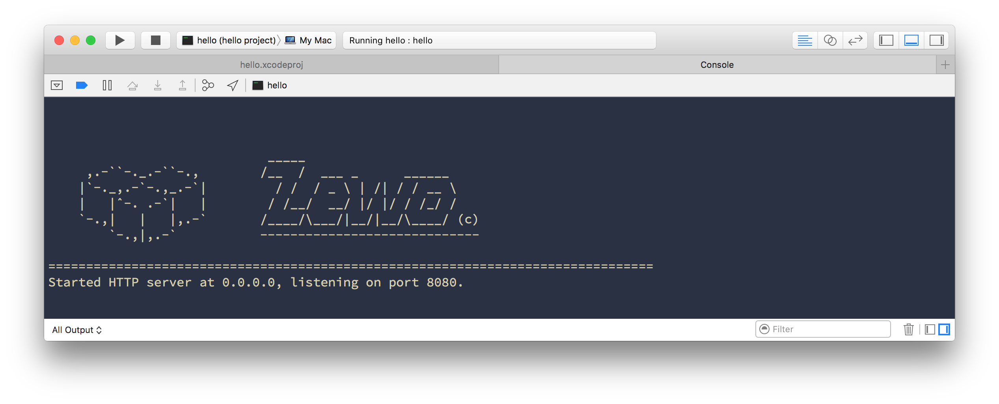
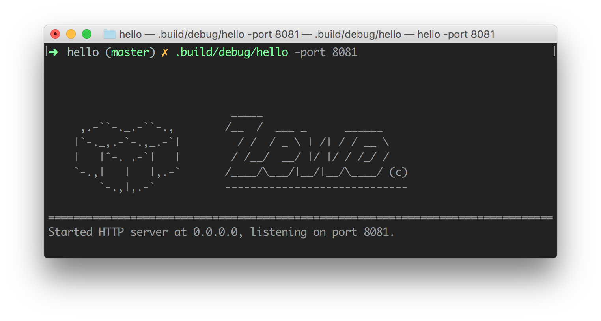

<p align="center">
    <a href="http://zewo.io"></a>
</p>

<p align="center">
    <a href="https://swift.org"></a>
    <a href="https://tldrlegal.com/license/mit-license"></a>
    <a href="http://slack.zewo.io"></a>
    <a href="https://travis-ci.org/Zewo/Zewo"></a>
    <a href="https://codecov.io/gh/Zewo/Zewo"></a>
    <a href="#backers"></a>
    <a href="#sponsors"></a>
</p>

<p align="center">
	   <a href="#what-sets-zewo-apart">Why Zewo?</a>
    • <a href="#getting-started">Getting Started</a>
    • <a href="#support">Support</a>
    • <a href="#community">Community</a>
    • <a href="https://github.com/Zewo/Zewo/blob/master/CONTRIBUTING.md">Contributing</a>
</p>

# Zewo

**Zewo** is a set of libraries for server-side development. With **Zewo** you can write your web app, REST API, command line tool, database driver, etc. Our goal is to create an ecosystem around the modules and tools we provide so you can focus on developing your application or library, instead of doing everything from scratch.

Check out our [organization](https://github.com/Zewo) for the modules.

## What sets Zewo apart?

Zewo is **not** a web framework. Zewo is a set of **modular** libraries for server-side Swift. It is designed so you can pick and choose the modules you want/need for the task you have at hand. Most server-side Swift projects use Grand Central Dispatch (**GCD**) as the concurrency library of choice. The drawback of using GCD is that its APIs are **asynchronous**. With async code comes **callback hell** and we all know it, it's no fun.

Node.js is the best example of how callbacks can be frustrating. Express.js creator **TJ Holowaychuk** wrote a blog post about [Callback vs Coroutines](https://medium.com/@tjholowaychuk/callbacks-vs-coroutines-174f1fe66127#.3l3pf1xqf) in 2013 and one year later [left the Node.js community](https://medium.com/@tjholowaychuk/farewell-node-js-4ba9e7f3e52b#.okwqsltyx) in favor of Go. There were many reasons for that but one of the main reasons was the concurrency model. Sure we have futures and promises and functional reactive programming. They all mitigate the problem, but the async nature of the code will always be there.

At **Zewo** we use **coroutines**. Coroutines allow concurrency while maintaining **synchronous** APIs. We all learn how to program with synchronous code. We're used to reason about our code synchronously. Being able to use synchronous APIs makes the code much more readable and understandable. Coroutines are also **faster** than threads, because they're much lighter.

Our implementation of **coroutines** (which is based on [libmill](https://github.com/sustrik/libmill)) is **single-threaded**. This means that you don't have to worry about **locks** or **race conditions**. So your code is **safer** by default. To use all the CPU power available all you have to do is to replicate the work according to the number of logical CPUs available. As an example, this could mean running as many processes of your server as cores in your machine. **Rob Pike**, one of the creators of Go had a talk called [Concurrency is not Parallelism](https://www.youtube.com/watch?v=cN_DpYBzKso) that explains this concept **very** well. Go also has the philosophy:

```
Don't communicate by sharing memory. Share memory by communicating.
```

Like Go, instead of sharing memory and handling state we promote the use of [CSP](https://en.wikipedia.org/wiki/Communicating_sequential_processes)-style concurrency using channels. This pattern brings the abstractions used on the development of distributed systems closer to the way we're used to think about communication. It also aligns well with Swift's mindset of immutability and value types. All of these things contributes to a distinct experince on the server-side Swift.

With **Zewo** you get:

* Modular Frameworks
* Go-style Concurrency
* Synchronous APIs
* Incredible Performance
* Safer Applications
* Scalable Systems
* Cleaner Code
* Proper Error Handling
* No Callback Hell
* No Race Conditions

## Test Coverage

[![Test Coverage][codecov-sunburst]][codecov-url]

The inner-most circle is the entire project, moving away from the center are folders then, finally, a single file. The size and color of each slice is represented by the number of statements and the coverage, respectively.

## Getting Started

### Install swiftenv

The [swiftenv](https://github.com/kylef/swiftenv) tool allows you to easily install, and switch between multiple versions of Swift. You can install **swiftenv** following official [instructions](https://github.com/kylef/swiftenv#installation).

⚠️ With **homebrew** use:

```sh
brew install kylef/formulae/swiftenv --HEAD
```

### Install Swift 3.0 Release

Once you have **swiftenv** installed, install the Swift 3.0 Release.

```sh
swiftenv install 3.0
```

### Create your first Zewo web application

First we need to create a directory for our app.

```sh
mkdir hello && cd hello
```

Now we select Swift 3.0 Release with **swiftenv**.

```sh
swiftenv local 3.0
```

This command will create a file called `.swift-version` containing `3.0`. **swiftenv** uses this file to select the correct `swift` binary. Now we initialize the project with the Swift Package Manager (**SwiftPM**).


```
swift package init --type executable
```

This command will create the basic structure for our app.

```
.
├── .gitignore
├── .swift-version
├── Package.swift
├── Sources
│   └── main.swift
└── Tests
```

`Package.swift` is the manifest file used by **SwiftPM** to configure your Swift package. Open `Package.swift` with your favorite editor and add `HTTPServer` as a dependency.

```swift
import PackageDescription

let package = Package(
    name: "hello",
    dependencies: [
        .Package(url: "https://github.com/Zewo/HTTPServer.git", majorVersion: 0, minor: 13),
    ]
)
```

### Do your magic

`main.swift` is the entry file of your application. Open `main.swift` and make it look like this:

```swift
import HTTPServer

let router = BasicRouter { route in
    route.get("/hello") { request in
        return Response(body: "Hello, world!")
    }
}

let server = try Server(port: 8080, responder: router)
try server.start()
```

This code:

- Imports the `HTTPServer` module
- Creates a `BasicRouter`
- Configures a route matching any `Request` with **GET** as the HTTP method and **/hello** as the path.
- Returns a `Response` with `"Hello, world!"` as the body for requests matching the route.
- Creates an HTTP server that listens on port `8080`.
- Starts the server.

### Build and run
Now let's build the app using **SwiftPM**.

```sh
swift build
```

After it compiles, let's run it.

```sh
.build/debug/hello
```



Now open your favorite browser and go to [http://localhost:8080/hello](http://localhost:8080/hello). You should see **Hello, world!** in your browser's window. 😊



By default the server will log the requests/responses which are receiveid/sent by the server.



Press `⌃C` (`Control-C`) to stop the server.

### Xcode

Using an IDE can be a huge boost to productivity. Luckily, **SwiftPM** has **Xcode** project generation support built in.

To generate your **Xcode** project simply run:

```sh
swift package generate-xcodeproj
```

Open your **Xcode** project by double clicking it on Finder or with:

```sh
open hello.xcodeproj
```

To run the application select the command line application scheme `hello` on **Xcode**.



Now click the run button ► or use the shortcut `⌘R`. You should see the server running directly from your **Xcode**.



You can set breakpoints in your code and debug it as usual.


To stop the server just click the stop button ■ or use the shortcut `⌘.`.

### Deploying to Heroku

Now the most fun part. Deploying your app to production. For this we'll use [Heroku](https://www.heroku.com) which is a cloud PaaS (Platform as a Service). Heroku is great specially because it's extremely easy to use and for this example you won't have to spend a dime. So if you don't have a Heroku account [sign up for free](https://signup.heroku.com). After signing up check out the instrunctions to download and install the [heroku command line](https://devcenter.heroku.com/articles/heroku-command-line). 

⚠️ You just need to go to the part where you do `heroku login`. The part where you create your app is what we'll do here. 😉

Heroku works very tightly with git. So let's initialize our git repo. Go back to the command line and do:

```sh
git init
``` 

Cool, now before we commit we need to make some changes. First, create a file called `Procfile` at the root of your project.

```sh
touch Procfile
```

`Procfile` is the file used by Heroku to configure your application. For more information go [here](https://devcenter.heroku.com/articles/procfile). Now, open `Procile` in your favorite editor and make it look like this:

```
web: hello -port $PORT
```

`web` states that our application is a web application. `hello -port $PORT` is simply the executable of our application. Heroku doesn't allow you to choose the port where your web application will run. So it gives you the port through the environment variable `PORT`. `hello -port $PORT` gets the `PORT` environment variable and passes it to our application as a command line argument. So now we have to access that argument and send it to our server.

Let's edit our `main.swift` to accomodate those changes. You can use Xcode or a text editor to make it look like this:

```swift
import HTTPServer

let router = BasicRouter { route in
    route.get("/hello") { request in
        return Response(body: "Hello, world!")
    }
}

let arguments = try Configuration.commandLineArguments()
let port = arguments["port"].int ?? 8080

let server = try Server(port: port, responder: router)
try server.start()
``` 

We just added two lines. The first tries to parse the command line arguments passed to the application. The second tries to get the `port` argument as an integer, if it doesn't exists or if it's not an integer then it uses the default value `8080`.

Now let's try it locally. Compile and run with Xcode or with SwiftPM.

```swift
swift build
.build/debug/hello -port 8081
```



Cool, let's stage our files and commit.

```sh
git add .
git commit -am "it starts"
```

Next step is to create the Heroku app. To use Swift on Heroku we need a swift buildpack. We'll use [heroku-buildpack-swift](https://github.com/kylef/heroku-buildpack-swift), a buildpack created by @kylef, the same dude that created **swiftenv**. Now that we know which buildpack to use we just need to run:

```sh
heroku create {your-heroku-app-name} --buildpack https://github.com/kylef/heroku-buildpack-swift.git 
```

⚠️ Don't forget to swap `{your-heroku-app-name}` for a nice name. Maybe something like hello-zewo-1969?

This command will create an app in your account at Heroku (don't worry it's free) and set up a git remote called `heroku`. All we have to do now it's push to this remote.

```sh
git push heroku master
````

Heroku will use the buildpack to install swiftenv then Swift and its dependencies and finally it will compile and start your app using the `Procfile`.

### What's next?

Check out our [organization](https://github.com/Zewo) for more. You can also take a look at our [documentation](http://zewo.readme.io). If you have any doubts you can reach us at our [slack](http://slack.zewo.io). We're very active and always ready to help.

## Support

If you have **any** trouble create a Github [issue](https://github.com/QuarkX/Quark/issues/new) and we'll do everything we can to help you. When stating your issue be sure to add enough details and reproduction steps so we can help you faster. If you prefer you can join our [Slack](http://slack.zewo.io) and go to the **#help** channel too.

## Community

[![Slack][slack-image]][slack-url]

We have an amazing community of open and welcoming developers. Join us on [Slack](http://slack.zewo.io) to get to know us!

## Contribution

Yo! Want to be a part of **Zewo**? Check out our [Contribution Guidelines](CONTRIBUTING.md).

## Backers

Support us with a monthly donation and help us continue our activities. [[Become a backer](https://opencollective.com/zewo#backer)]

<a href="https://opencollective.com/zewo/backer/0/website" target="_blank"></a>
<a href="https://opencollective.com/zewo/backer/1/website" target="_blank"></a>
<a href="https://opencollective.com/zewo/backer/2/website" target="_blank"></a>
<a href="https://opencollective.com/zewo/backer/3/website" target="_blank"></a>
<a href="https://opencollective.com/zewo/backer/4/website" target="_blank"></a>
<a href="https://opencollective.com/zewo/backer/5/website" target="_blank"></a>
<a href="https://opencollective.com/zewo/backer/6/website" target="_blank"></a>
<a href="https://opencollective.com/zewo/backer/7/website" target="_blank"></a>
<a href="https://opencollective.com/zewo/backer/8/website" target="_blank"></a>
<a href="https://opencollective.com/zewo/backer/9/website" target="_blank"></a>
<a href="https://opencollective.com/zewo/backer/10/website" target="_blank"></a>
<a href="https://opencollective.com/zewo/backer/11/website" target="_blank"></a>
<a href="https://opencollective.com/zewo/backer/12/website" target="_blank"></a>
<a href="https://opencollective.com/zewo/backer/13/website" target="_blank"></a>
<a href="https://opencollective.com/zewo/backer/14/website" target="_blank"></a>
<a href="https://opencollective.com/zewo/backer/15/website" target="_blank"></a>
<a href="https://opencollective.com/zewo/backer/16/website" target="_blank"></a>
<a href="https://opencollective.com/zewo/backer/17/website" target="_blank"></a>
<a href="https://opencollective.com/zewo/backer/18/website" target="_blank"></a>
<a href="https://opencollective.com/zewo/backer/19/website" target="_blank"></a>
<a href="https://opencollective.com/zewo/backer/20/website" target="_blank"></a>
<a href="https://opencollective.com/zewo/backer/21/website" target="_blank"></a>
<a href="https://opencollective.com/zewo/backer/22/website" target="_blank"></a>
<a href="https://opencollective.com/zewo/backer/23/website" target="_blank"></a>
<a href="https://opencollective.com/zewo/backer/24/website" target="_blank"></a>
<a href="https://opencollective.com/zewo/backer/25/website" target="_blank"></a>
<a href="https://opencollective.com/zewo/backer/26/website" target="_blank"></a>
<a href="https://opencollective.com/zewo/backer/27/website" target="_blank"></a>
<a href="https://opencollective.com/zewo/backer/28/website" target="_blank"></a>
<a href="https://opencollective.com/zewo/backer/29/website" target="_blank"></a>

## Sponsors

Become a sponsor and get your logo on our website Zewo.io and on our README on Github with a link to your site. [[Become a sponsor](https://opencollective.com/zewo#sponsor)]

<a href="https://opencollective.com/zewo/sponsor/0/website" target="_blank"></a>
<a href="https://opencollective.com/zewo/sponsor/1/website" target="_blank"></a>
<a href="https://opencollective.com/zewo/sponsor/2/website" target="_blank"></a>
<a href="https://opencollective.com/zewo/sponsor/3/website" target="_blank"></a>
<a href="https://opencollective.com/zewo/sponsor/4/website" target="_blank"></a>
<a href="https://opencollective.com/zewo/sponsor/5/website" target="_blank"></a>
<a href="https://opencollective.com/zewo/sponsor/6/website" target="_blank"></a>
<a href="https://opencollective.com/zewo/sponsor/7/website" target="_blank"></a>
<a href="https://opencollective.com/zewo/sponsor/8/website" target="_blank"></a>
<a href="https://opencollective.com/zewo/sponsor/9/website" target="_blank"></a>
<a href="https://opencollective.com/zewo/sponsor/10/website" target="_blank"></a>
<a href="https://opencollective.com/zewo/sponsor/11/website" target="_blank"></a>
<a href="https://opencollective.com/zewo/sponsor/12/website" target="_blank"></a>
<a href="https://opencollective.com/zewo/sponsor/13/website" target="_blank"></a>
<a href="https://opencollective.com/zewo/sponsor/14/website" target="_blank"></a>
<a href="https://opencollective.com/zewo/sponsor/15/website" target="_blank"></a>
<a href="https://opencollective.com/zewo/sponsor/16/website" target="_blank"></a>
<a href="https://opencollective.com/zewo/sponsor/17/website" target="_blank"></a>
<a href="https://opencollective.com/zewo/sponsor/18/website" target="_blank"></a>
<a href="https://opencollective.com/zewo/sponsor/19/website" target="_blank"></a>
<a href="https://opencollective.com/zewo/sponsor/20/website" target="_blank"></a>
<a href="https://opencollective.com/zewo/sponsor/21/website" target="_blank"></a>
<a href="https://opencollective.com/zewo/sponsor/22/website" target="_blank"></a>
<a href="https://opencollective.com/zewo/sponsor/23/website" target="_blank"></a>
<a href="https://opencollective.com/zewo/sponsor/24/website" target="_blank"></a>
<a href="https://opencollective.com/zewo/sponsor/25/website" target="_blank"></a>
<a href="https://opencollective.com/zewo/sponsor/26/website" target="_blank"></a>
<a href="https://opencollective.com/zewo/sponsor/27/website" target="_blank"></a>
<a href="https://opencollective.com/zewo/sponsor/28/website" target="_blank"></a>
<a href="https://opencollective.com/zewo/sponsor/29/website" target="_blank"></a>

## License

All **Zewo** modules are released under the MIT license. See [LICENSE](LICENSE) for details.

[slack-image]: http://s13.postimg.org/ybwy92ktf/Slack.png
[slack-url]: http://slack.zewo.io
[codecov-url]: https://codecov.io/gh/Zewo/Zewo
[codecov-sunburst]: https://codecov.io/gh/Zewo/Zewo/branch/master/graphs/sunburst.svg